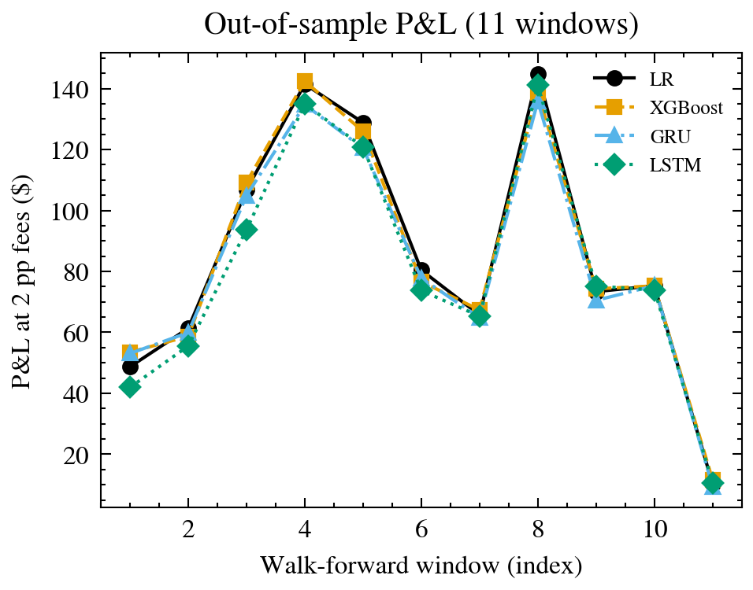

# Complexity Is Not an Edge

Cross-platform prediction-market arbitrage on Kalshi and Polymarket

## Team

Ian Sabia & Alvin Jang — DS340 Spring 2026, Boston University

---

## Problem

- Kalshi (CFTC-regulated) and Polymarket (on-chain) list the same events at different prices
- Discrepancies can persist for hours — a potential statistical-arbitrage opportunity
- **Central question: does increasing model complexity improve arbitrage detection?**

---

## Methods

- **Four model tiers:** LR / XGBoost → GRU / LSTM / TFT → PPO → PPO + autoencoder
- **59 engineered features** including 13 academic microstructure estimators (Amihud, Corwin–Schultz, Kyle, Roll, favorite–longshot)
- **5 evaluation regimes:** single-split backtest, 11-window walk-forward, per-category, data-scaling curve, live paper trading
- **Autonomous live system** on BU SCC: 15-min trade cycle, 10,154 closed positions

---

## Challenge

Three silent-failure bugs looked like model problems but were infrastructure:

- Kalshi `/events` returned 429 on 40% of calls **silently** — starved the pair universe
- Polymarket singular `condition_id=` returned *random* markets (plural `condition_ids=` works)
- `live_NNNN` pair_id drift across three code paths → resolved via content-addressed IDs

**Lesson:** monitor the data pipeline before tuning the model.

---

## Results

- XGBoost (**+$201.63**) ≈ LR (**+$201.69**) > LSTM > GRU >> PPO (**−$7,724**)
- Every walk-forward window profitable; per-pair annualized Sharpe **≈ 3.2**
- Alpha lives in the **matching pipeline and oil/commodities class**, not the models

---

## Conclusions

- **Simplest models win at this data scale** — a direct empirical answer to the research question
- The negative result on PPO is real evidence, not a bug
- The autonomous live system is still accumulating data; the ranking may flip at 500+ bars/pair
- **Project lesson:** evaluation regime matters more than model family
